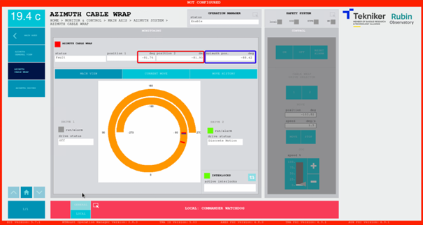
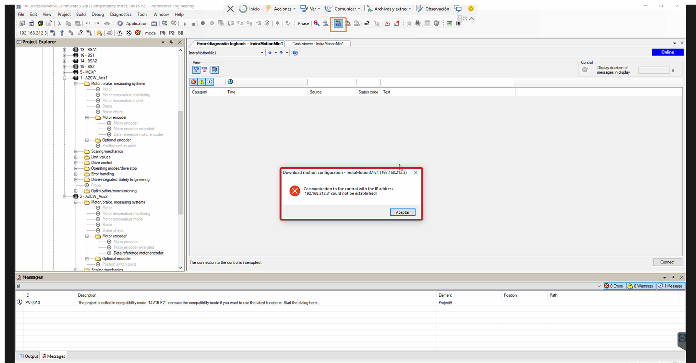
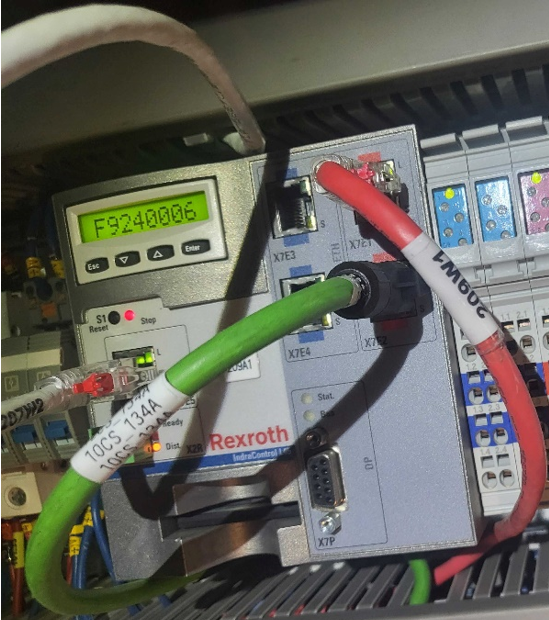
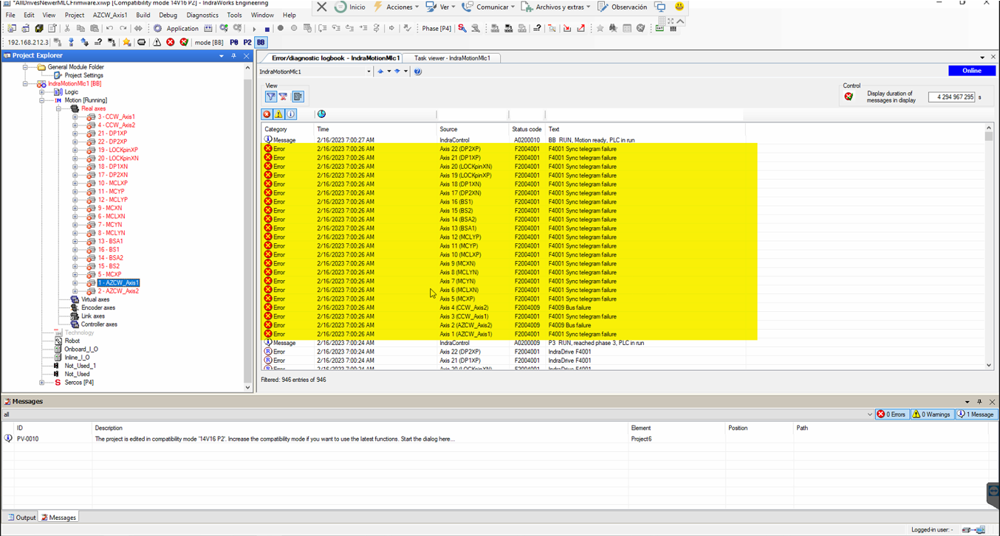
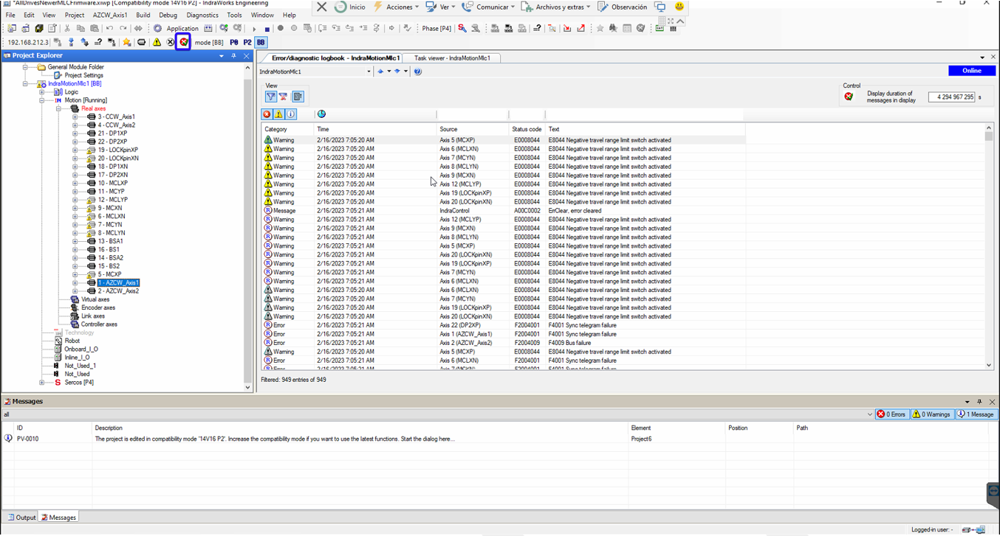
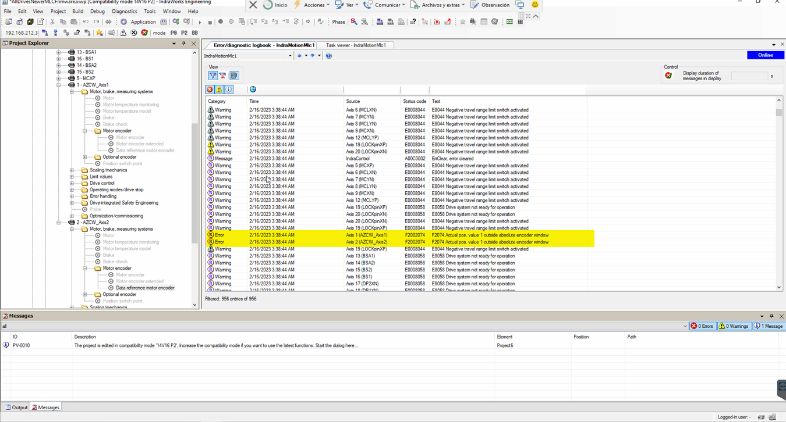
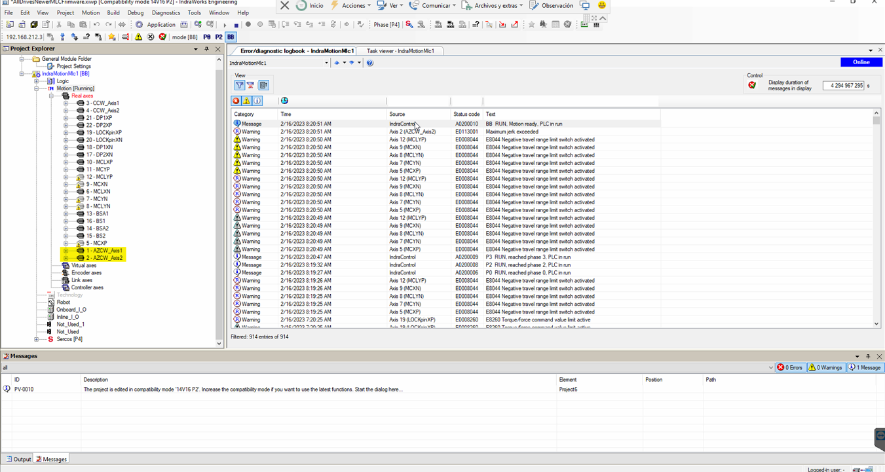
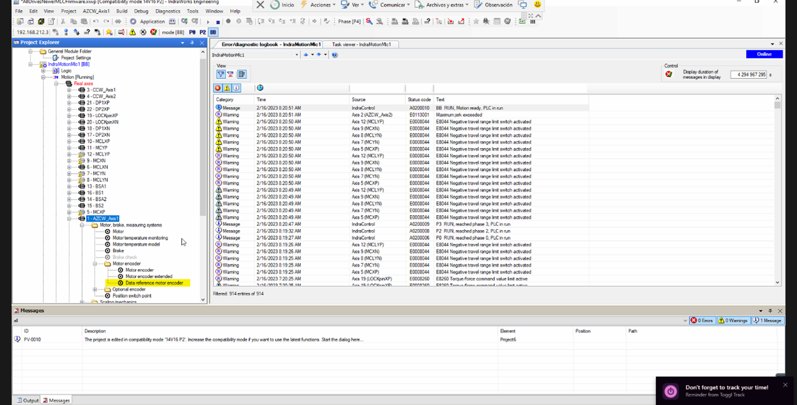
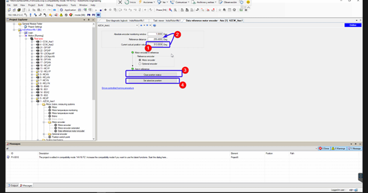
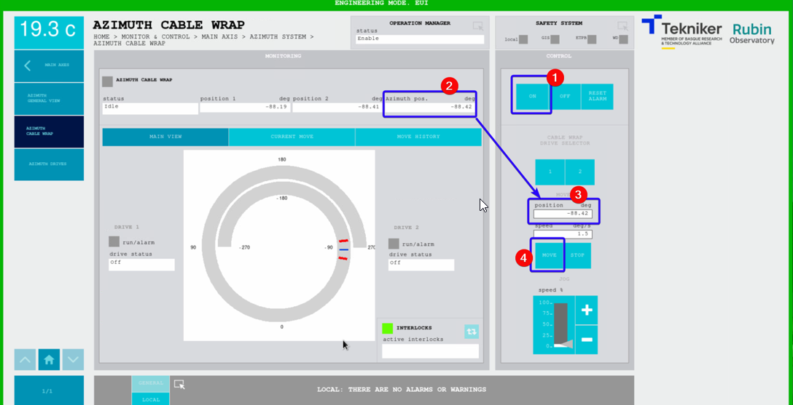

# Bosch Rexroth Recovery

| **Requested by:**     | **GHESA**       |
| --------------------- | --------------- |
| **Doc. Code**         | --              |
| **Editor:**           | Alberto Izpizua |
| **Approved by:**      | Julen García    |
| **Minor changes by:** | JSeron          |

## Introduction

This document shows how to recover the Bosch system.

## Diagnosis of the Issue

We detect one or more of the following issues:

- **Cannot power on or control** any of the Bosh systems: Azimuth Cable Wrap (ACW), Camera Cable Wrap (CCW), Locking Pins
  (LP), Mirror Covers (MC), Deployable platforms (DP).
- ACW issue
  - Fault in Azimuth (Az) including STO.
  - In the Safety System window there is a triggered interlock for the **ACW limit** (lim+ or lim-).
  - In ACW window, the position difference between Az and ACW exceeds 3 deg, which is physically impossible by design,
    as the Az drags the ACW when it reaches its hardware limit.

- Making a **ping to the Bosch controller** (139.229.171.23) faults.
- No connection with the **Indraworks Engineering Tool** (installed on Tekniker's remote support computer).
  This is typically a symptom.
  > Note this tool should only be used in critical cases.

- **Fatal error** (F9XXXX) detected in the Bosh controller located inside the TMA-CBT-CS-AZ-0001 cabinet.

## Solving the issue

To resolve the issue, follow these steps, detailed in the subsections below:

1. Reboot the controller by performing a power-off/power-on sequence.
2. Clear any existing errors.
3. **IF** there is an actual position value issue, resolve it.
4. Align the ACW with AZ in the TMA EUI.

### 1. Reboot the Bosch Controller

Remove and reinsert the module indicated in the figure in the orange rectangle:

1. **Press the flange** on top of the module indicated with the blue arrow
2. **Remove** the module. The control light will turn off
3. **Wait** for a few seconds
4. **Reinsert** the module to power the controller back on
5. **Wait** for the system to reboot (this may take a few seconds)
6. Open the **Indraworks Engineering Tool**, you may see sync telegram failures errors

### 2. Clear errors

1. Clear sync telegram failures errors by switching the modes to P0 and BB:
    1. Press the ` P0 ` button, to switch to P0 mode
    2. Wait a few seconds until the status shows P0 to the left of the button
    3. Press the ` BB ` button to switch to BB mode and restore communication (this may take up to a minute)

2. Clear remaining errors with the clear button

### 3. Case: Issue with actual position value

Execute this step **IF AND ONLY IF BOTH** of the following conditions are met:

- The log shows an error like: “Actual pos. value 1 outside absolute encoder window.“
- The ACW motors are in fault (red)

#### Solving the issue with the actual position value

> ⚠ **WARNING** ⚠
> Only proceed if you fully understand the procedure as some of these steps are delicate and could be causing further issues if not performed correctly.

1. In the Indraworks Engineering Tool, open AZCW motor in use, e.g. AZCW_Axis1

2. Open the page "Data reference motor encoder"

3. In the "Data reference motor encoder" tab
    1. Check the ` Current actual position `  (1, in the figure) is within ±3.5 deg the actual Azimuth position + 360 Deg.
       For example, if Azimuth is at 10 deg, the current actual position should be between 6.5 and 13.5 deg.
    1. If the position is OK then copy the value in field (1) to ` Reference distance ` (2).
    2. Click in ` Clear position status ` (3).
    3. Click ` Set absolute position ` (4).

*Figure: Data reference motor encoder tab. In this case, the ` Current actual position ` is 513. If the TMA Az is between 149.5 and 156.5 degrees, copy the current actual value (513) to the ` Reference distance ` field, then press buttons labelled as 3 and 4. .*

### 4. Align ACW with Az - in the TMA EUI

1. Set Azimuth axis to idle state
2. Go to Azimuth Cable Wrap window
    1. Turn on ACW motor
    2. Copy the actual Az position
    3. Paste it to the position field
    4. Move ACW
    5. Turn off ACW motor
3. Go to the Safety System
    1. Reset the ACW issue
4. Continue with operations

