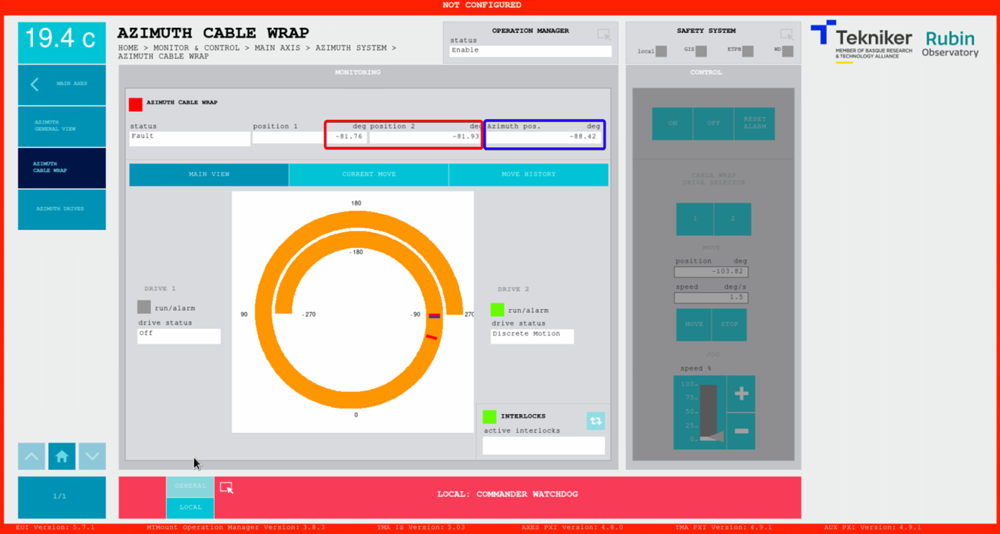
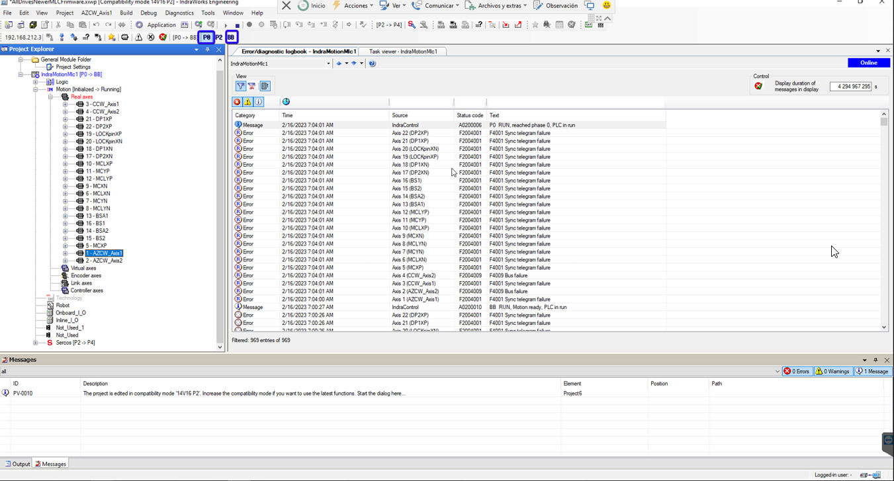

# Bosch Rexroth Recovery

| **Requested by:** | **GHESA** |
| --- | --- |
| **Doc. Code** | -- |
| **Editor:** | Alberto Izpizua |
| **Approved by:** | Julen García |
<!-- minor changes from JSeron--> 

## Introduction

This document shows how to recover the Bosch

## Diagnosis of the Issue

We detect one or more of the following issues:

- **Cannot power on or control** any of the Bosh systems: Azimuth Cable Wrap (ACW), Camera Cable Wrap (CCW), Locking Pins (LP), Mirror Covers (MC), Deployable platforms (DP). <!-- This is new, it was mentioned in the OS traning--> 

<!-- The first thing we receive are some faults in azimuth and one of them is the STO. In the safety system window the interlock for the AZ cable wrap lim+ or AZ cable wrap lim-.
Going to the Azimuth Cable Wrap window the position distance from azimuth and azimuth cable wrap is bigger than about 3 deg. This is not possible, since azimuth drags azimuth cable wrap when azimuth gets the hardware limit (this hardware limit is designed for that).--> 

- ACW issue
     - Fault in Azimuth (Az) including STO.
     - In the Safety System window there is a triggered interlock for the **ACW limit** (lim+ or lim-).
     - In ACW window, the position difference between Az and ACW exceeds 3 deg, which is physically impossible by design, as the Az drags the ACW when it reaches its hardware limit. 

- Making a **ping to the Bosch controller** (102.168.212.3) faults.

<!-- Also, the connection using Indraworks Engineering Tool(it is installed in the Tekniker's remote support computer), the connection is not possible. -->  
- No connection with the **Indraworks Engineering Tool** (installed on Tekniker's remote support computer).  This is typically a symptom. Note this tool should only be used in critical cases.

<!-- In the Bosch controller, located in the TMA-CBT-CS-AZ-0001, the F9XXXX error is shown. The F9XXX errors are Fatal error.-->
- **Fatal error** (F9XXXX) detected in the Bosh controller located inside the TMA-CBT-CS-AZ-0001 cabinet.

## Solving the issue

<!-- To solve the issue the controller must be rebooted manually with a power off power on sequence.-->
<!-- |||| AS a summary of the procedure -->

To resolve the issue, follow these steps, detailed in the subsections below: 
1. Reboot the controller by performing a power-off/power-on sequence.
2. Clear any existing errors.
3. **IF** there is an actual position value issue, resolve it.
4. Align the ACW in the TMA EUI.

<!-- ### Rebooting the Bosch Controller and checkin the status--> 
### 1. Reboot the Bosch Controller 

<!-- To remove power, take out the last module (orange one in next figure), pressing the flange marked with the blue arrow. The light from the control goes. After a few seconds, the module can be reallocated again to get the power for the controller again. ||| Rewritten as a numbered list below---> 

Remove and reinsert the module indicated in the figure in the orange rectangle: 

1. **Press the flange** on top of the module indicated with the blue arrow
2. **Remove** the module. The control light will turn off
3. **Wait** for a few seconds
4. **Reinsert** the module to power the controller back on
5. **Wait** for the system to reboot (this make take a few seconds)
6. Open the **Indraworks Engineering Tool**, you may see sync telegram failures errors

<!--  After recovering the power in the controller, it will start the boot process that takes some seconds. After that time, the Indraworks Engineering Tool could connect to the system. Probably there are som sync telegram failures errors. ||| Added as a last step above -->

<!-- To solve sync failures put the system in P0 pressing the P0 button. It takes a few seconds, an the status is indicated next to the P0 button. Once the controller is in P0, then press the BB button to get back the communication working again. This operation takes nearly a minute.
If there are still errors in the system try to clear the errors with the clear error button. ||| Rewritten as a numbered list below-->

<!-- New title below -->

### 2. Clear errors 

1. Clear sync telegram failures errors by switching the modes to P0 and BB:
    1. Press the ` P0 ` button, to switch to P0 mode
    2. Wait a few seconds until the status shows P0 to the left of the button
    3. Press the ` BB ` button to switch to BB mode and restore communication (this may take up to a minute)

2. Clear remaining errors with the clear button
   

### 3. Case: Issue with actual position value

<!-- If an error related with actual position value outside absolute encoder window appears next steps must be done in the Indraworks Engineering Tool. If this error does not appear just continue with steps in the EUI window. |||| rephrased below--> 

Execute this step **IF AND ONLY IF BOTH** of the following conditions are met:

- The log shows an error like: “Actual pos. value 1 outside absolute encoder window.“ 
- The ACW motors are in fault (red)

#### Solving the issue with the actual position value

<!-- |||BELOW "troubles" changed to "issues if not performed correctly".-->

> ⚠ **WARNING** ⚠
> Only proceed if you fully understand the procedure as some of these steps are delicate and could be causing further issues if not performed correctly.

<!-- This point is valid only if the error Actual position value outside absolute encoder window, shown in the figure above, appears in the log and the azimuth cable wrap motors are in fault (red). ||| MOVED ABOVE -->

<!-- Open the AZCW_Axis1 motor -->
1. In the Indraworks Engineering Tool, open AZCW motor in use, e.g. AZCW_Axis1

2. Open the page "Data reference motor encoder"
  

<!-- Check that the current position (1, in the next figure) is inside ±3.5 deg the actual azimuth position + 360 Deg (this is, if azimuth is at 10 Deg here  something between 6.5 and 13.5 Deg must be shown). If the position is OK then copy this value to "Reference distance" (2), click in "Clear position status" (3) and then "Set absolute position" (4). ||| Rewritten as a numbered list below--> 

3. In the "Data reference motor encoder" tab
    1. Check the ` Current actual position `  (1, in the figure) is within ±3.5 deg the actual Azimuth position + 360 Deg.  For example, if Azimuth is at 10 deg, the current actual position should be between 6.5 and 13.5 deg. 
    2. If the position is OK then copy the value in field (1) to ` Reference distance ` (2).
    3. Click in ` Clear position status ` (3).
    4. Click ` Set absolute position ` (4).

*Figure: Data reference motor encoder tab. In this case, the ` Current actual position ` is 513. If the TMA Az is between 149.5 and 156.5 degrees, copy the current actual value (513) to the ` Reference distance ` field, then press buttons labelled as 3 and 4. .*

<!-- Change titled below -->
### 4. Align ACW with Az - in the TMA EUI 

<!-- The last steps must be done in the EUI.--> 

<!-- In the EUI, go to the Azimuth Cable Wrap window and with Azimuth axis in idle state:

1. Switch on azimuth cable wrap
2. Copy the actual azimuth position
3. Paste in the position to move
4. Move azimuth cable wrap.
|||| All steps in a numbered list 
--> 
1. Set Azimuth axis to idle state
2. Go to Azimuth Cable Wrap window
    1. Turn on ACW motor
    2. Copy the actual Az position 
    3. Paste it to the position field
    4. Move ACW
    5. Turn off ACW motor  <!-- |||| added this -->
3. Go to the Safety System 
    1. Reset the ACW issue
4. Continue with operations

<!-- Reset the Azimuth cable wrap issue in the safety system and continue with the powering on of the system. ||| moved above--> 
