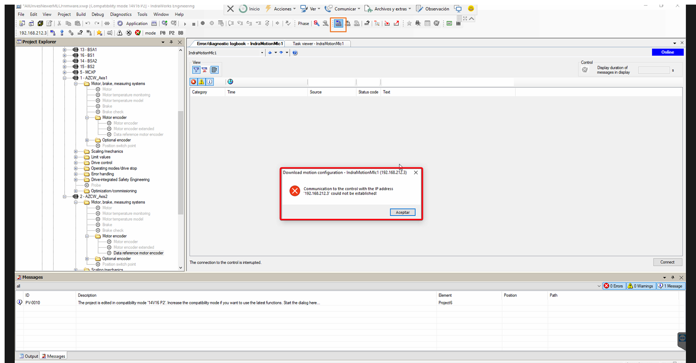
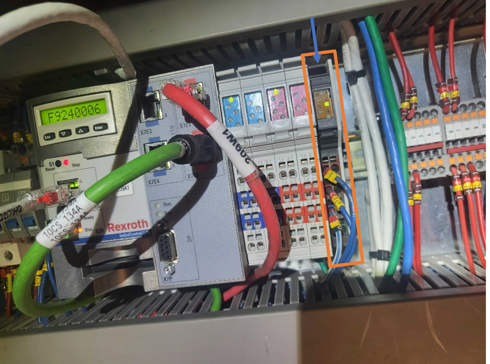
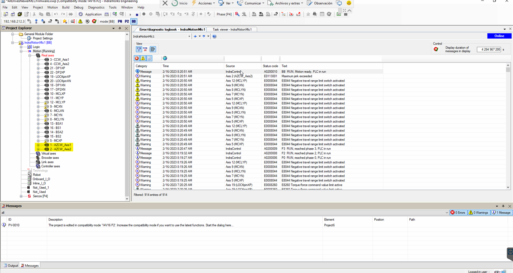
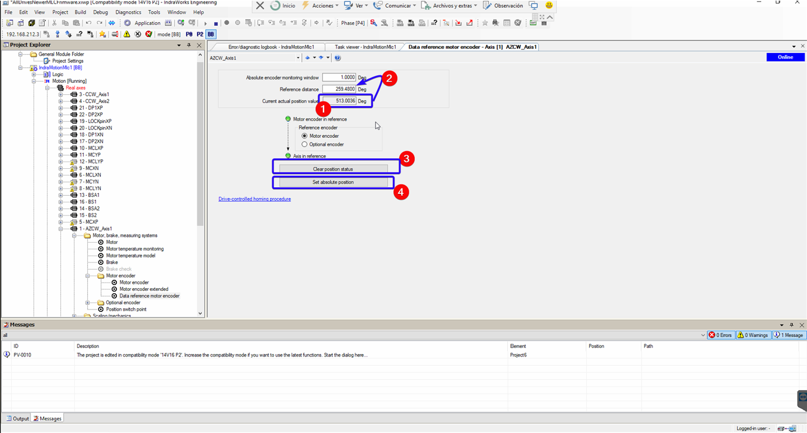

# BoschRexrothRecovery

| **Requested by:** | **GHESA** |
| --- | --- |
| **Doc. Code** | -- |
| **Editor:** | Alberto Izpizua |
| **Approved by:** | Julen García |

## Introduction

This document shows how to recover the Bosch

## Diagnosis of the Issue

The first thing we receive are some faults in azimuth and one of them is the STO. In the safety system window the interlock for the AZ cable wrap lim+ or AZ cable wrap lim-.
Going to the Azimuth Cable Wrap window the position distance from azimuth and azimuth cable wrap is bigger than about 3 deg. This is not possible, since azimuth drags azimuth cable wrap when azimuth gets the hardware limit (this hardware limit is designed for that).

Also, the connection using Indraworks Engineering Tool(it is installed in the Tekniker's remote support computer), the connection is not possible. Making a ping to the Bosch controller (102.168.212.3) faults.

In the Bosch controller, located in the TMA-CBT-CS-AZ-0001, the F9XXXX error is shown. The F9XXX errors are Fatal error.

## Solving the issue

To solve the issue the controller must be rebooted manually with a power off power on sequence.

### Rebooting the Bosch Controller and checkin the status

To remove power, take out the last module (orange one in next figure), pressing the flange marked with the blue arrow. The light from the control goes. After a few seconds, the module can be reallocated again to get the power for the controller again.

After recovering the power in the controller, it will start the boot process that takes some seconds. After that time, the Indraworks Engineering Tool could connect to the system. Probably there are som sync telegram failures errors.

To solve sync failures put the system in P0 pressing the P0 button. It takes a few seconds, an the status is indicated next to the P0 button. Once the controller is in P0, then press the BB button to get back the communication working again. This operation takes nearly a minute.

If there are still errors in the system try to clear the errors with the clear error button.

If an error related with actual position value outside absolute encoder window appears next steps must be done in the Indraworks Engineering Tool. If this error does not appear just continue with steps in the EUI window.

### Solving issue with actual position value

This point is valid only if the error Actual position value outside absolute encoder window, shown in the figure above, appears in the log and the azimuth cable wrap motors are in fault (red).

Open the AZCW_Axis1 motor

Open the page "Data reference motor encoder"

Check that the current position (1, in the next figure) is inside ±3.5 deg the actual azimuth position + 360 Deg (this is, if azimuth is at 10 Deg here  something between 6.5 and 13.5 Deg must be shown). If the position is OK then copy this value to "Reference distance" (2), click in "Clear position status" (3) and then "Set absolute position" (4).

### EUI steps

The last steps must be done in the EUI.

In the EUI, go to the Azimuth Cable Wrap window and with Azimuth axis in idle state:

1. Switch on azimuth cable wrap
2. Copy the actual azimuth position
3. Paste in the position to move
4. Move azimuth cable wrap.

Reset the Azimuth cable wrap issue in the safety system and continue with the powering on of the system.
